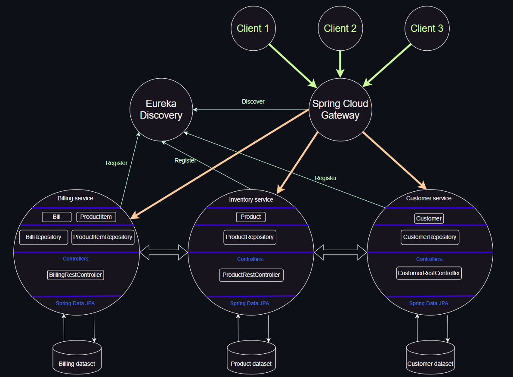

# 🍃 Spring Cloud Micro-services Architecture 
# Under development... 🚀

- [Customer micro-service](https://github.com/Slimani-CE/customer-service)
- [Inventory micro-service](https://github.com/Slimani-CE/inventory-service)
- [Billing micro-service](https://github.com/Slimani-CE/billing-service)
- [Gateway micro-service](https://github.com/Slimani-CE/gateway-service)
- [Eureka discovery](https://github.com/Slimani-CE/eureka-discovery)

# Table of Contents
- [Overview](#overview)
- [Architecture](#architecture)
    - [Customer service](#Customer-service)
    - [Inventory service](#Inventory-service)
    - [Billing service](#Billing-service)
    - [Gateway service](#Gateway-service)
    - [Eureka discovery](#Eureka-discovery)
    - [Angular client](#Angular-client)
# Overview
This project is a microservices-based architecture designed to handle various functionalities related to customer management, inventory management, and billing. It involves the development and deployment of multiple microservices using Java frameworks and libraries.

1. Customer-service:

    * Creation of the Customer microservice, which handles customer-related operations.

    * Implementation of the Customer entity and the CustomerRepository interface using Spring Data.

    * Deployment of the RESTful API of the microservice using Spring Data Rest.

    * Testing of the Customer microservice. 

2. Inventory-service:

    * Creation of the Inventory microservice, responsible for managing product inventory.
    * Implementation of the Product entity and the ProductRepository interface using Spring Data.
    * Deployment of the RESTful API of the microservice using Spring Data Rest.
    * Testing of the Inventory microservice.

3. Gateway service:

    * Creation of the Gateway service using Spring Cloud Gateway.
    * Testing of the service proxy using both static configuration based on the application.yml file and static configuration based on Java configuration.

4. Registry Service:

    * Creation of the Registry Service based on Netflix Eureka Server, which acts as a service registry.
    * Testing of the proxy using dynamic route management to communicate with the registered microservices in the Eureka Server.
5. Billing-Service:

    * Creation of the Billing microservice using Open Feign to communicate with the Customer-service and Inventory-service.
6. Angular client:

    * Creation of an Angular client application that allows the display of invoices.
    
This project demonstrates the implementation of microservices architecture using various technologies and frameworks such as Spring Data, Spring Cloud Gateway, Netflix Eureka Server, and Open Feign. It showcases the development of individual microservices with their respective functionalities and communication between them. Additionally, it includes the creation of a client application using Angular to provide a user interface for viewing invoices.

# Architecture

## Customer service
* Customer entity
```java
@Entity
@Data @AllArgsConstructor @NoArgsConstructor @Builder @ToString
public class Customer {
    @Id @GeneratedValue(strategy = GenerationType.IDENTITY)
    private Long id;
    private String name;
    private String email;
}
```
* Application.properties
```properties
server.port = 8081
spring.application.name = customer-service
spring.datasource.url = jdbc:h2:mem:customer-db
# Prevent the service to register itself. While our eureka discovery
# is not set up yet. This will prevent the service to register itself.
spring.cloud.discovery.enabled = false
# To expose all endpoints
management.endpoints.web.exposure.include = health,info,help
```
* Add some data to the database
```java
@Bean
CommandLineRunner start(CustomerRepository customerRepository, RepositoryRestConfiguration repositoryRestConfiguration){
    repositoryRestConfiguration.exposeIdsFor(Customer.class);
    return args -> {
        Stream.of("Ahmed", "Salma", "Mustapha", "Othman", "Sanae").forEach(name ->{
            Customer customer = Customer.builder()
                    .id(null)
                    .name(name)
                    .email(name + "@gmail.com")
                    .build();
            customerRepository.save(customer);
        });
    };
}
```
* REST API test: Navigate to http://localhost:8081/customers


## Inventory service
* Product entity
```java
@Entity
@AllArgsConstructor
@NoArgsConstructor @Builder
@Data @ToString
public class Product {
    @Id @GeneratedValue(strategy = GenerationType.IDENTITY)
    private Long id;
    private String name;
    private Double price;
    private Double quantity;
}
```
* Application.properties
```properties
server.port = 8082
spring.application.name = inventory-service
spring.datasource.url = jdbc:h2:mem:inventory-db
spring.cloud.discovery.enabled = false
# To expose endpoints
management.endpoints.web.exposure.include = health,info,help
```
* Add some data to the database
```java
@Override
public void run(String... args) throws Exception {
    // Expose Products Id
    repositoryRestConfiguration.exposeIdsFor(Product.class);

    productRepository.save(new Product(null, "LAPTOP HP", 3500., 5.));
    productRepository.save(new Product(null, "HyperX Headphones", 1500., 10.));
    productRepository.save(new Product(null, "MACBOOK PRO", 9000., 5.));
    productRepository.save(new Product(null, "DELL DESKTOP", 5000., 5.));
    productRepository.findAll().forEach(product -> {
        System.out.println("Product name: " + product.getName());
    });
}
```
* REST API test: Navigate to http://localhost:8082/products


## Billing service
* Bill entity
```java
@Entity
@Data @AllArgsConstructor
@NoArgsConstructor @Builder @ToString
public class Bill {
    @Id @GeneratedValue(strategy = GenerationType.IDENTITY)
    private Long id;
    private Date billingDate;
    @OneToMany(mappedBy = "bill")
    private Collection<ProductItem> productItems;
    private Long customerId;
    @Transient
    private Customer customer;
}
```
* ProductItem entity
```java
@Entity
@Data @AllArgsConstructor @NoArgsConstructor @ToString @Builder
public class ProductItem {
    @Id @GeneratedValue(strategy = GenerationType.IDENTITY)
    private Long id;
    private Long productID;
    private Double price;
    private Integer quantity;
    @Transient
    private Product product;
    @ManyToOne
    @JsonProperty(access = JsonProperty.Access.WRITE_ONLY)
    private Bill bill;
}
```
* Model package
    * Product class
    ```java
    @Data
    @AllArgsConstructor
    @NoArgsConstructor
    @ToString
    public class Product {
        private Long id;
        private String name;
        private Double price;
        private Double quantity;
    }
    ```
    * Customer class
    ```java
    @Data
    @AllArgsConstructor
    @NoArgsConstructor
    @ToString
    public class Customer {
        private Long id;
        private String name;
        private String email;
    }
    ```
* feign package
    * CustomerRestClient interface
    ```java
    @FeignClient(name = "CUSTOMER-SERVICE")
    public interface CustomerRestclient {
        @GetMapping(path = "/customers/{id}")
        Customer getCustomerById(@PathVariable(name = "id") Long id);
    }
    ```
    * InventoryRestClient interface
    ```java
    @FeignClient(name = "INVENTORY-SERVICE")
    public interface InventoryRestClient {
        @GetMapping(path = "/products")
        PagedModel<Product> pageProducts() ;

        @GetMapping(path = "/products/{id}")
        Product getProductById(@PathVariable Long id);
    }
    ```
    * BillRestController: Web layer
    ```java
    @RestController
    @RequestMapping("/web")
    public class BillingRestController {

        private final BillRepository billRepository;
        private final CustomerRestclient customerRestclient;
        private final InventoryRestClient inventoryRestClient;

        public BillingRestController(BillRepository billRepository, CustomerRestclient customerRestclient, InventoryRestClient inventoryRestClient) {
            this.billRepository = billRepository;
            this.customerRestclient = customerRestclient;
            this.inventoryRestClient = inventoryRestClient;
        }

        @GetMapping(path = "/fullBill/{id}")
        public Bill getBill(@PathVariable("id") Long id){
            Bill bill = billRepository.findById(id).get();
            bill.setCustomer(customerRestclient.getCustomerById(bill.getCustomerId()));
            bill.getProductItems().forEach(productItem -> {
                Product product = inventoryRestClient.getProductById(productItem.getProductID());
                productItem.setProduct(product);
            });
            return bill;
        }
    }
    ```
* Application.properties
```properties
server.port = 8083
spring.application.name = billing-service
spring.datasource.url = jdbc:h2:mem:billing-db
spring.cloud.discovery.enabled = false
management.endpoints.web.exposure.include = health,info,help
```
* Add some data to the database
```java
@Override
public void run(String... args) throws Exception {
    repositoryRestConfiguration.exposeIdsFor(Bill.class);
    repositoryRestConfiguration.exposeIdsFor(ProductItem.class);
    Customer customer = customerRestclient.getCustomerById(1L);
    Bill bill = billRepository.save(new Bill(null, new Date(), null, customer.getId(), customer));
    PagedModel<Product> productPagedModel = inventoryRestClient.pageProducts();
    productPagedModel.forEach(p -> {
        ProductItem productItem = ProductItem.builder()
                .price(p.getPrice())
                .quantity(1 + new Random().nextInt(100))
                .bill(bill)
                .productID(p.getId())
                .build();
        productItemRepository.save(productItem);
        System.out.println(p);
    });
}
```
* REST API test: Navigate to http://localhost:8083/web/fullBill/1 (Explore bill with id 1)

## Gateway service
* definition locator: this is where we define the routes dynamically
```java
@SpringBootApplication
public class GatewayServiceApplication {

    public static void main(String[] args) {
        SpringApplication.run(GatewayServiceApplication.class, args);
    }

    @Bean
    DiscoveryClientRouteDefinitionLocator definitionLocator(ReactiveDiscoveryClient rdc, DiscoveryLocatorProperties properties){
        return new DiscoveryClientRouteDefinitionLocator(rdc, properties);
    }
}
```
* Application.properties
```properties
server.port = 8888
spring.application.name = gateway-service
spring.cloud.discovery.enabled = false
# To expose all endpoints
management.endpoints.web.exposure.include = health,info,help
```
## Eureka discovery
* Main application class
```java
@SpringBootApplication
@EnableEurekaServer
public class EurekaDiscoveryApplication {

	public static void main(String[] args) {
		SpringApplication.run(EurekaDiscoveryApplication.class, args);
	}
}
```
* Application.properties
```properties
server.port = 8761
eureka.client.fetch-registry =  false
# configures the Eureka client to not register itself with the Eureka server.
eureka.client.register-with-eureka = false
# To expose all endpoints
management.endpoints.web.exposure.include = help
```
* Test Eureka server: Navigate to http://localhost:8761/


## Angular client
* Products component


* Customers component
